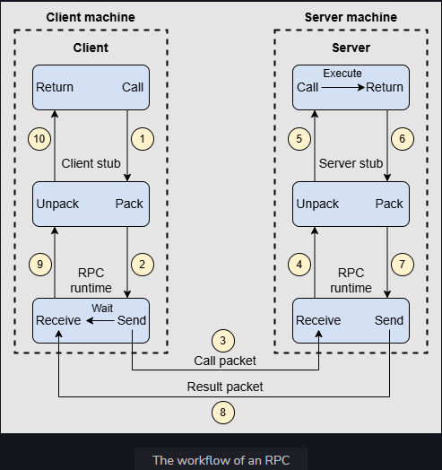
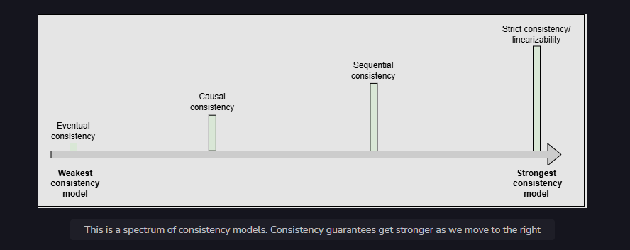
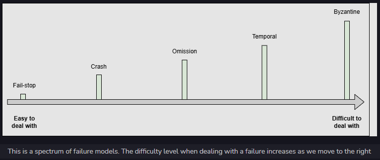
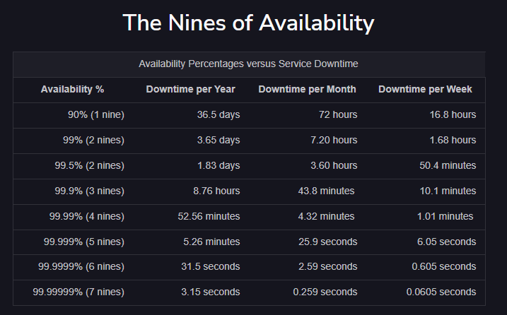
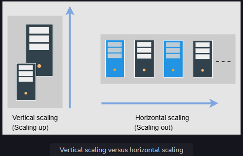

# What is System Design?

System Design is the process of defining the architecture, components, modules, interfaces, and data flow for a system to meet sepicific requirements

It ivolves making high level decision about scalability, reliability, performance and maintainability

Used in real-world application, like designing scalable web apps, distributed systems, databases and cloud infrastructures

# Why System Design is Important?

* Scalability and Reliability - Ensures system handle millions of users without failure.
* Architectural Thinking - Goes beyond coding, involves trade-offs like CAP theorem, SQL vs NoSQL
* Trade-Offs - balances scalability, cost, speed and complexity
* Future proofing - Prevents bottlenecks and allows smooth evolution of software

# The Evolution

1995 - 2005 -> Monolithic

* LAMP stack - linux, appache, MySQL, PHP dominated
* Stateless, server side rendering, single node databases

2005 - 2010 -> Scaling Challenges and Distributed Systems

* Introduction of Caching (memcached, redis), CDNS
* database replications
* Horizontal scaling and Load Balancing

2010 - 2015 -> Cloud Revolution

* AWS, Azure, GCP enabled on demand infra
* Shift to virtualized and Containerized
* NoSQL databases (cassandra, MongoDB). sharding

2015 - 2020 -> Microservices & Event Driven Architecture

* API Gateway, Serrvice meshes, CI/CD

2020 - Present -> AI Era

* low latency
* serverless, kubernets, edge computing
* security, compliance

## Topics

* [Database abstraction](#database-abstraction)
* [Abstractions in distributed systems](#abstractions-in-distributed-systems)
* [Network Abstractions](#network-abstractions-remote-procedure-calls)
* [Consistency](#what-is-consistency)
* [The Spectrum of Failure Models](#the-spectrum-of-failure-models)
* [Availability](#what-is-availability)
* [Reliability](#what-is-reliability)
* [Scalability](#what-is-scalability)
* [Maintainability](#what-is-maintainability)
* [Fault tolerance](#what-is-fault-tolerance)

---

# Database abstraction

Transactions is a database abstraction that hides many problematic outcomes when concurrent users are reading, writing, or mutating the data and gives a simple interface of commit, in case of success, or abort, in case of failure. Either way, the data moves from one consistent state to a new consistent state. The transaction enables end users to not be bogged down by the subtle corner-cases of concurrent data mutation, but rather concentrate on their business logic.

# Abstractions in distributed systems

Abstractions in distributed systems help engineers simplify their work and relieve them of the burden of dealing with the underlying complexity of the distributed systems.

The abstraction of distributed systems has grown in popularity as many big companies like Amazon AWS, Google Cloud, and Microsoft Azure provide distributed services. Every service offers different levels of agreement. The details behind implementing these distributed services are hidden from the users, thereby allowing the developers to focus on the application rather than going into the depth of the distributed systems that are often very complex.

Today’s applications can’t remain responsive/functional if they’re based on a single node because of an exponentially growing number of users. Abstractions in distributed systems help engineers shift to distributed systems quickly to scale their applications.

# Network Abstractions: Remote Procedure Calls

Remote procedure calls (RPCs) provide an abstraction of a local procedure call to the developers by hiding the complexities of packing and sending function arguments to the remote server, receiving the return values, and managing any network retries.

## What is an RPC?

RPC is an interprocess communication protocol that’s widely used in distributed systems. In the OSI model of network communication, RPC spans the transport and application layers.

RPC mechanisms are employed when a computer program causes a procedure or subroutine to execute in a separate address space.

## How does RPC work?

When we make a remote procedure call, the calling environment is paused and the procedure parameters are sent over the network to the environment where the procedure is to be executed.

When the procedure execution finishes, the results are returned to the calling environment where execution restarts as a regular procedure call.

To see how it works, let’s take an example of a client-server program. There are five main components involved in the RPC program, as shown in the following illustration:

The RPC method is similar to calling a local procedure, except that the called procedure is usually executed in a different process and on a different computer.

RPC allows developers to build applications on top of distributed systems. Developers can use the RPC method without knowing the network communication details. As a result, they can concentrate on the design aspects, rather than the machine and communication-level specifics.

# What is consistency?

In distributed systems, consistency may mean many things. One is that each replica node has the same view of data at a given point in time. The other is that each read request gets the value of the recent write. These are not the only definitions of consistency, since there are many forms of consistency. Normally, consistency models provide us with abstractions to reason about the correctness of a distributed system doing concurrent data reads, writes, and mutations.

If we have to design or build an application in which we need a third-party storage system like S3 or Cassandra, we can look into the consistency guarantees provided by S3 to decide whether to use it or not

## Spectrum of Consistency Models

The two ends of the consistency spectrum are:

* Strongest consistency
* Weakest consistency

There is a difference between consistency in ACID properties and consistency in the CAP theorem.

Database rules are at the heart of ACID consistency. If a schema specifies that a value must be unique, a consistent system will ensure that the value is unique throughout all actions. If a foreign key indicates that deleting one row will also delete associated rows, a consistent system ensures that the state can’t contain related rows once the base row has been destroyed.

CAP consistency guarantees that, in a distributed system, every replica of the same logical value has the same precise value at all times. It’s worth noting that this is a logical rather than a physical guarantee. Due to the speed of light, replicating numbers throughout a cluster may take some time. By preventing clients from accessing different values at separate nodes, the cluster can nevertheless give a logical picture.

### 1. Eventual consistency

Eventual consistency is the weakest consistency model. The applications that don’t have strict ordering requirements and don’t require reads to return the latest write choose this model. Eventual consistency ensures that all the replicas will eventually return the same value to the read request, but the returned value isn’t meant to be the latest value. However, the value will finally reach its latest state.

Eventual consistency ensures high availability.

Example:

The domain name system is a highly available system that enables name lookups to a hundred million devices across the Internet. It uses an eventual consistency model and doesn’t necessarily reflect the latest values.

Note: Cassandra is a highly available NoSQL database that provides eventual consistency.

### 2. Causal consistency

Causal consistency works by categorizing operations into dependent and independent operations. Dependent operations are also called causally-related operations. Causal consistency preserves the order of the causally-related operations.

This model doesn’t ensure ordering for the operations that are not causally related. These operations can be seen in different possible orders.

Causal consistency is weaker overall, but stronger than the eventual consistency model. It’s used to prevent non-intuitive behaviors.

Example:

The causal consistency model is used in a commenting system. For example, for the replies to a comment on a Facebook post, we want to display comments after the comment it replies to. This is because there is a cause-and-effect relationship between a comment and its replies.

### 3. Sequential consistency

Sequential consistency is stronger than the causal consistency model. It preserves the ordering specified by each client’s program. However, sequential consistency doesn’t ensure that the writes are visible instantaneously or in the same order as they occurred according to some global clock.

Example:

In social networking applications, we usually don’t care about the order in which some of our friends’ posts appear. However, we still anticipate a single friend’s posts to appear in the correct order in which they were created). Similarly, we expect our friends’ comments in a post to display in the order that they were submitted. The sequential consistency model captures all of these qualities.

### 4. Strict consistency aka linearizability

A strict consistency or linearizability is the strongest consistency model. This model ensures that a read request from any replicas will get the latest write value. Once the client receives the acknowledgment that the write operation has been performed, other clients can read that value.

Linearizability is not obvious in a distributed system.

Synchronous replication ensures linearizability, in which an acknowledgment is not sent to the client until the new value is written to all replicas.

Linearizability affects the system’s availability, which is why it’s not always used. Applications with strong consistency requirements use techniques like quorum-based replication to increase the system’s availability.

Example

Updating an account’s password requires strict consistency.

Amazon Aurora provides strong consistency.

## The Spectrum of Failure Models

Failures are obvious in the world of distributed systems and can appear in various ways. They might come and go, or persist for a long period.

Failure models provide us a framework to reason about the impact of failures and possible ways to deal with them.

### 1. Fail-stop

In this type of failure, a node in the distributed system halts permanently. However, the other nodes can still detect that node by communicating with it.

From the perspective of someone who builds distributed systems, fail-stop failures are the simplest and the most convenient.

### 2. Crash

In this type of failure, a node in the distributed system halts silently, and the other nodes can’t detect that the node has stopped working.

### 3. Omission failures

In omission failures, the node fails to send or receive messages. There are two types of omission failures. If the node fails to respond to the incoming request, it’s said to be a send omission failure. If the node fails to receive the request and thus can’t acknowledge it, it’s said to be a receive omission failure.

### 4. Temporal failures

In temporal failures, the node generates correct results, but is too late to be useful. This failure could be due to bad algorithms, a bad design strategy, or a loss of synchronization between the processor clocks.

### 5. Byzantine failures

In Byzantine failures, the node exhibits random behavior like transmitting arbitrary messages at arbitrary times, producing wrong results, or stopping midway. This mostly happens due to an attack by a malicious entity or a software bug. A byzantine failure is the most challenging type of failure to deal with.

# What is availability?

Availability is the percentage of time that some service or infrastructure is accessible to clients and is operated upon under normal conditions. For example, if a service has 100% availability, it means that the said service functions and responds as intended (operates normally) all the time.

Mathematically, availability, A, is a ratio. The higher the A value, the better. We can also write this up as a formula:

A (in percent) = (total time - not available time) / total time * 100

We measure availability as a number of nines. The following table shows how much downtime is permitted when we’re using a given number of nines.

# What is reliability?

Reliability, R, is the probability that the service will perform its functions for a specified time. R measures how the service performs under varying operating conditions.

We often use mean time between failures (MTBF) and mean time to repair (MTTR) as metrics to measure R.

MTBF = (Total Elapsed Time - Sum of Downtime) / Total Number of Failures

MTTR = Total Maintenance Time / Total Number of Repairs

strive for a higher MTBF value and a lower MTTR value.

# What is scalability?

Scalability is the ability of a system to handle an increasing amount of workload without compromising performance. A search engine, for example, must accommodate increasing numbers of users, as well as the amount of data it indexes.

### 1. Vertical scalability—scaling up

Vertical scaling, also known as “scaling up,” refers to scaling by providing additional capabilities (for example, additional CPUs or RAM) to an existing device. Vertical scaling allows us to expand our present hardware or software capacity, but we can only grow it to the limitations of our server. The dollar cost of vertical scaling is usually high because we might need exotic components to scale up.

### 2. Horizontal scalability—scaling out

Horizontal scaling, also known as “scaling out,” refers to increasing the number of machines in the network. We use commodity nodes for this purpose because of their attractive dollar-cost benefits. The catch here is that we need to build a system such that many nodes could collectively work as if we had a single, huge server.

# What is maintainability?

Besides building a system, one of the main tasks afterward is keeping the system up and running by finding and fixing bugs, adding new functionalities, keeping the system’s platform updated, and ensuring smooth system operations. One of the salient features to define such requirements of an exemplary system design is maintainability. We can further divide the concept of maintainability into three underlying aspects:

1. Operability: This is the ease with which we can ensure the system’s smooth operational running under normal circumstances and achieve normal conditions under a fault.
2. Lucidity: This refers to the simplicity of the code. The simpler the code base, the easier it is to understand and maintain it, and vice versa.
3. Modifiability: This is the capability of the system to integrate modified, new, and unforeseen features without any hassle.

Maintainability, M, is the probability that the service will restore its functions within a specified time of fault occurrence. M measures how conveniently and swiftly the service regains its normal operating conditions.

For example, suppose a component has a defined maintainability value of 95% for half an hour. In that case, the probability of restoring the component to its fully active form in half an hour is 0.95.

We use (mean time to repair) MTTR as the metric to measure M.

Maintainability gives us insight into the system’s capability to undergo repairs and modifications while it’s operational.

# What is fault tolerance?

Fault tolerance refers to a system’s ability to execute persistently even if one or more of its components fail. Here, components can be software or hardware. Conceiving a system that is hundred percent fault-tolerant is practically very difficult.

Fault tolerance techniques

## 1. Replication

One of the most widely-used techniques is replication-based fault tolerance. With this technique, we can replicate both the services and data. We can swap out failed nodes with healthy ones and a failed data store with its replica. A large service can transparently make the switch without impacting the end customers.

## 2. Checkpointing

Checkpointing is a technique that saves the system’s state in stable storage when the system state is consistent. Checkpointing is performed in many stages at different time intervals. The primary purpose is to save the computational state at a given point. When a failure occurs in the system, we can get the last computed data from the previous checkpoint and start working from there.

Checkpointing also comes with the same problem that we have in replication. When the system has to perform checkpointing, it makes sure that the system is in a consistent state, meaning that all processes are stopped. This type of checkpointing is known as synchronous checkpointing. On the other hand, checkpointing in an inconsistent state leads to data inconsistency problems.