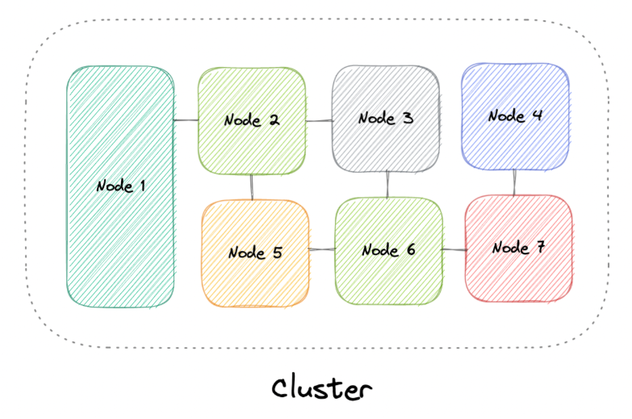
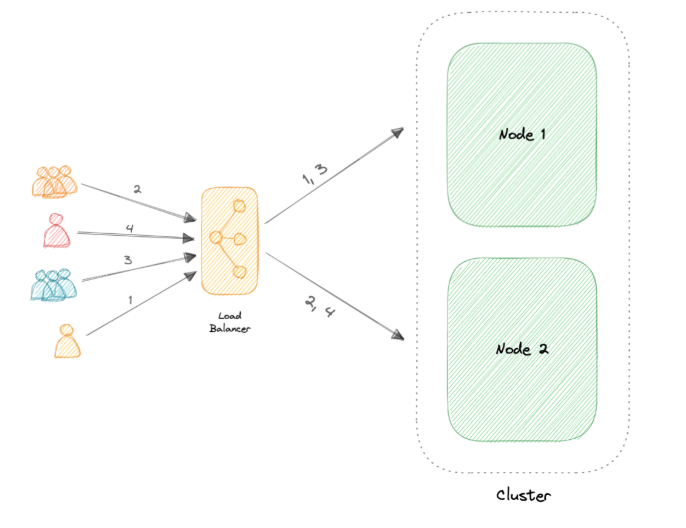
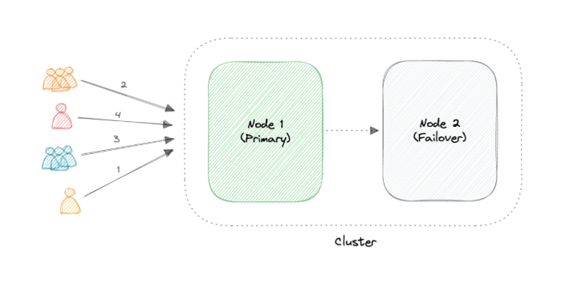

# 🧩 Clustering — System Design Reference

A **cluster** is a group of two or more machines (nodes) working together as a single system.

Clustering allows workloads to be distributed across multiple machines to improve:

- Availability
- Scalability
- Performance
- Fault tolerance

Ideally, users should not know whether they are interacting with one machine or many.

---

## 📑 Table of Contents

- [What is Clustering?](#-what-is-clustering)
- [How a Cluster Works](#-how-a-cluster-works)
- [Types of Clusters](#-types-of-clusters)
- [Cluster Configurations](#-cluster-configurations)
- [Clustering vs Load Balancing](#-clustering-vs-load-balancing)
- [Advantages](#-advantages)
- [Challenges](#-challenges)
- [Real-World Examples](#-real-world-examples)
- [System Design Notes](#-system-design-notes)

---

## 🔍 What is Clustering?

A cluster:

- Consists of multiple nodes connected over a network  
- Shares workload across machines  
- May use shared or distributed storage  
- Appears as a single system to users  

Often, one node acts as a **leader (master)**:

- Receives incoming requests  
- Distributes tasks  
- Aggregates results  

Modern systems may use leader election instead of fixed master nodes.

---

## ⚙️ How a Cluster Works

1. Client sends request
2. Leader (or entry node) receives it
3. Work is distributed to other nodes
4. Results are combined
5. Response is returned

Clusters minimize:

- Latency  
- Single points of failure  
- Resource bottlenecks  

---

## 🧠 Types of Clusters

### 1️⃣ High Availability (Failover)

- Ensures system stays online  
- Backup nodes take over if primary fails  

Used in:
- Databases  
- Critical systems  

---

### 2️⃣ Load Balancing Clusters

- Distribute traffic evenly  
- Improve throughput  

Often combined with load balancers.

---

### 3️⃣ High Performance Computing (HPC)

- Used for compute-heavy tasks  
- Scientific simulations  
- Big data processing  

Focus: parallel processing power.

---

## 🔄 Cluster Configurations

### 🔹 Active-Active

- All nodes actively serve traffic  
- Improves throughput  
- Requires load balancing  

Advantages:
- Higher performance  
- Better resource utilization  

---

### 🔹 Active-Passive

- One active node  
- One or more standby nodes  
- Standby takes over on failure  

Advantages:
- Simpler setup  
- Strong failover support  

---

## ⚖️ Clustering vs Load Balancing

| Clustering | Load Balancing |
|------------|---------------|
Nodes are aware of each other | Servers are unaware of each other  
Focus on coordination & redundancy | Focus on traffic distribution  
Often share state or storage | Typically stateless routing  

They are often used **together**, but they solve different problems.

---

## ✅ Advantages

- High availability  
- Horizontal scalability  
- Improved performance  
- Cost efficiency (commodity hardware)  

---

## ⚠️ Challenges

Clustering introduces complexity:

- Deployment & maintenance across nodes  
- Data synchronization  
- Shared storage coordination  
- Monitoring & logging aggregation  
- Leader election & failover handling  

Distributed systems complexity increases rapidly as nodes increase.

---

## 🌍 Real-World Examples

Clustering is common in:

### Containers
- Kubernetes  
- Amazon ECS  

### Databases
- Cassandra  
- MongoDB  

### Caching
- Redis Cluster  

---

## 🧠 System Design Notes

Clustering is used for:

- Horizontal scaling  
- Fault tolerance  
- Distributed databases  
- Microservices orchestration  

Interview topics often include:

- Leader election  
- Data replication  
- Consensus (Raft / Paxos)  
- Split-brain problem  
- CAP theorem implications  

---

