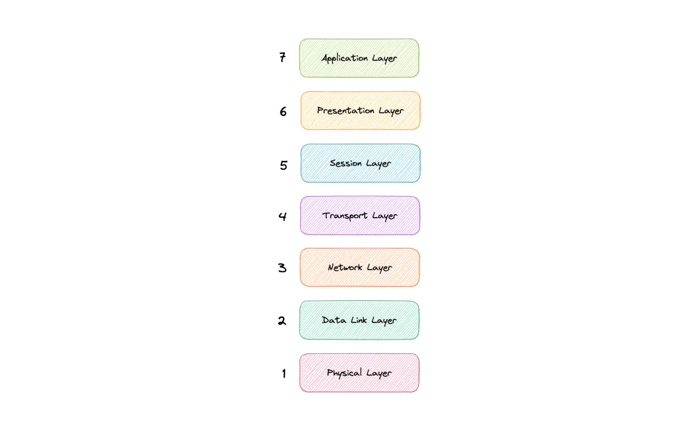

# 🧠 OSI Model

The **OSI Model (Open Systems Interconnection Model)** is a logical and conceptual model that defines how network communication works between systems.  
It describes how data is transmitted from one computer to another by breaking the process into **seven distinct layers**, each with a specific responsibility.

The OSI model helps standardize networking and provides a clear way to understand, design, and troubleshoot network systems.

🎥 **Reference Video:**  
[Watch here](https://www.youtube.com/watch?v=0y6FtKsg6J4&list=PLCRMIe5FDPsd0gVs500xeOewfySTsmEjf&index=14)

---

## 📑 Table of Contents

- [Overview](#-overview)
- [Why the OSI Model Matters](#-why-the-osi-model-matters)
- [OSI Layers](#-osi-layers)
  - [Application](#application)
  - [Presentation](#presentation)
  - [Session](#session)
  - [Transport](#transport)
  - [Network](#network)
  - [Data Link](#data-link)
  - [Physical](#physical)

---

## 🔍 Overview

The OSI model divides network communication into **seven layers**.  
Each layer has a specific role and communicates only with the layers directly above and below it.

This layered approach helps:

- Understand how data flows across a network  
- Design interoperable systems  
- Troubleshoot issues efficiently  

---

## ⭐ Why the OSI Model Matters

Even though modern networks mainly use the **TCP/IP model**, the OSI model is still extremely useful because it:

- Makes troubleshooting easier across the entire stack  
- Helps identify security threats  
- Encourages standardization between vendors  
- Builds a strong foundation for network and system design  
- Breaks complex networking into simple, understandable components  

---

## 🧬 OSI Layers

---

### Application (Layer 7)

The **application layer** is the only layer that directly interacts with user data.

It provides networking services to applications like:

- Web browsers  
- Email clients  
- File transfer tools  

⚠️ Note: The application itself is NOT the layer — the **protocols and data handling** are.

**Examples of protocols:**

- HTTP  
- HTTPS  
- FTP  
- SMTP  
- DNS  

---

### Presentation (Layer 6)

Also called the **translation layer**.

This layer ensures data is in a usable format before being sent or after being received.

**Main responsibilities:**

- Translation  
- Encryption / Decryption  
- Compression  

---

### Session (Layer 5)

Responsible for **starting, managing, and ending communication sessions**.

Functions include:

- Opening and closing sessions  
- Maintaining connections  
- Synchronizing data using checkpoints  
- Recovering sessions if interrupted  

---

### Transport (Layer 4)

Responsible for **end-to-end communication** between devices.

Key responsibilities:

- Breaking data into **segments**  
- Reassembling data at the destination  
- Flow control  
- Error control  

**Common protocols:**

- TCP (reliable, connection-oriented)  
- UDP (fast, connectionless)  

---

### Network (Layer 3)

Responsible for **routing and logical addressing**.

Functions include:

- Path selection (routing)  
- Breaking segments into **packets**  
- Logical addressing (IP addresses)  

If devices are on the **same network**, this layer is usually not required.

**Example protocols:**

- IP  
- ICMP  
- IPSec  

---

### Data Link (Layer 2)

Responsible for **node-to-node delivery** on the same network.

Functions include:

- Framing  
- MAC addressing  
- Error detection  
- Access to physical media  

Data is broken into **frames**.

**Examples:**

- Ethernet  
- ARP  
- Switches operate here  

---

### Physical (Layer 1)

Deals with the **actual physical transmission of data**.

Includes:

- Cables  
- Switches  
- Electrical signals  
- Bit streams (1s and 0s)  

Defines:

- Voltage levels  
- Pin layouts  
- Data rates  
- Transmission modes  

---

## 🧩 Quick Memory Trick

**All People Seem To Need Data Processing**

- Application  
- Presentation  
- Session  
- Transport  
- Network  
- Data Link  
- Physical  

---