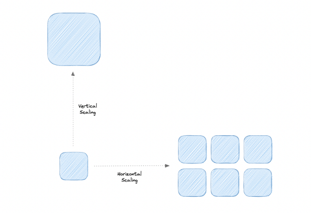

# 📈 Scalability — System Design Reference

**Scalability** is the ability of a system to handle increasing (or decreasing) load by adding or removing resources efficiently.

A scalable system maintains:

- Performance
- Availability
- Reliability
- Cost efficiency

---

## 📑 Table of Contents

- [What is Scalability?](#-what-is-scalability)
- [Vertical Scaling (Scale Up)](#-vertical-scaling-scale-up)
- [Horizontal Scaling (Scale Out)](#-horizontal-scaling-scale-out)
- [Vertical vs Horizontal Scaling](#-vertical-vs-horizontal-scaling)
- [Best Practices](#-best-practices)
- [System Design Notes](#-system-design-notes)

---

## 🔍 What is Scalability?

Scalability measures how well a system adapts to workload changes.

It answers:

- What happens when traffic doubles?
- Can the system handle 10x growth?
- How quickly can we scale during traffic spikes?

---

## ⬆️ Vertical Scaling (Scale Up)

Vertical scaling increases the power of an existing machine.

Examples:

- Add more CPU
- Increase RAM
- Upgrade storage
- Move to a bigger server

### ✅ Advantages

- Simple to implement
- Easier to manage
- Strong data consistency
- Minimal architectural changes

### ❌ Disadvantages

- Hardware limits
- Risk of downtime during upgrade
- Single point of failure
- Expensive at high scale

---

## ➡️ Horizontal Scaling (Scale Out)

Horizontal scaling adds more machines to distribute load.

Examples:

- Add more app servers
- Add more database replicas
- Use auto-scaling groups

Traffic is distributed using a load balancer.

### ✅ Advantages

- High availability
- Fault tolerance
- No hard hardware limits
- Easier rolling upgrades
- Supports large-scale systems

### ❌ Disadvantages

- Increased complexity
- Data consistency challenges
- Requires distributed system design
- More network overhead

---

## ⚖️ Vertical vs Horizontal Scaling

| Vertical Scaling | Horizontal Scaling |
|------------------|-------------------|
Scale one machine | Add more machines  
Limited by hardware | Virtually unlimited  
Simple architecture | Distributed complexity  
Single point of failure | Fault tolerant  

👉 Modern large-scale systems primarily rely on **horizontal scaling**.

---

## 🧠 Best Practices for Scalability

### 1️⃣ Avoid Single Point of Failure (SPOF)

- Use redundancy
- Replicate services
- Deploy across zones/regions

---

### 2️⃣ Loose Coupling

- Services should depend minimally on each other
- Enables independent scaling
- Improves resilience

---

### 3️⃣ Asynchronous Processing

Use event-driven architecture:

- Message queues
- Background workers
- Pub/Sub systems

Benefits:
- Smooth traffic spikes
- Decoupled components
- Better system stability

---

### 4️⃣ Stateless Services

- Store state externally (DB, cache)
- Makes horizontal scaling easier
- Enables easy replacement of nodes

---

### 5️⃣ Caching

- Reduce database load
- Improve response time
- Use CDN, Redis, etc.

---

## 🧠 System Design Notes

Interviewers often test:

- When to scale vertically vs horizontally?
- How to scale databases?
- Auto-scaling strategies
- Handling traffic spikes
- Trade-offs between consistency and availability

Scalability is deeply connected to:

- Load balancing
- Caching
- Replication
- Sharding
- Microservices architecture

---

