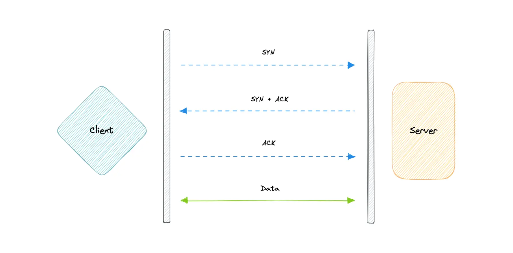
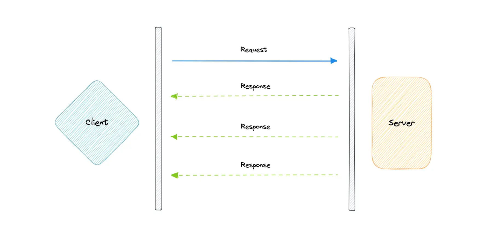

# 🔁 TCP vs UDP — Transport Layer Protocols

TCP and UDP are the two most important protocols in the **Transport Layer (Layer 4)** of the OSI model.  
They define **how data is sent between applications across a network.**

---

## 📑 Table of Contents

- [Overview](#-overview)
- [TCP (Transmission Control Protocol)](#-tcp-transmission-control-protocol)
- [UDP (User Datagram Protocol)](#-udp-user-datagram-protocol)
- [Key Differences](#-key-differences)
- [When to Use TCP vs UDP](#-when-to-use-tcp-vs-udp)

---

## 🔍 Overview

Both TCP and UDP:

- Run on top of IP  
- Use ports to identify applications  
- Operate at the Transport layer  

But they solve **different problems**.

---

## 🔒 TCP (Transmission Control Protocol)

TCP is a **connection-oriented** protocol.  
A connection must be established before data transfer begins.

TCP guarantees:

- ✅ Data delivery  
- ✅ Correct order  
- ✅ Error detection and recovery  
- ✅ Flow and congestion control  

This makes TCP **highly reliable**, but also adds **more overhead** and **latency**.

**Common use cases:**

- Web pages (HTTP/HTTPS)  
- File transfers  
- Emails  
- Database connections  

**Example services:**

- HTTP / HTTPS  
- FTP  
- SMTP  
- SSH  

🖼 Diagram:  

---

## ⚡ UDP (User Datagram Protocol)

UDP is a **connectionless** protocol.  
There is **no session setup**, and packets are sent without checking if they arrive.

UDP provides:

- ❌ No delivery guarantee  
- ❌ No ordering  
- ❌ No retransmission  
- ✅ Very low latency  
- ✅ Minimal overhead  

This makes UDP **fast and lightweight**, ideal when **speed matters more than reliability**.

**Common use cases:**

- Live streaming  
- Online gaming  
- Video calls  
- Broadcast and multicast traffic  
- DNS queries  

🖼 Diagram:  

---

## ⚖ Key Differences

| Feature            | TCP                          | UDP                          |
|--------------------|------------------------------|------------------------------|
| Connection type   | Connection-oriented          | Connectionless               |
| Reliability       | Guaranteed                   | Not guaranteed               |
| Order of packets  | Maintained                   | Not maintained               |
| Error recovery    | Yes                          | No                           |
| Speed              | Slower                       | Faster                       |
| Overhead          | High                         | Very low                     |
| Use case focus    | Accuracy & reliability      | Speed & real-time delivery  |

---

## 🎯 When to Use TCP vs UDP

### Use TCP when:

- Data must not be lost  
- Order matters  
- Accuracy is more important than speed  

Examples:  
✔ File transfers  
✔ Web applications  
✔ Banking systems  
✔ APIs  

---

### Use UDP when:

- Speed is critical  
- Small losses are acceptable  
- Late data is worse than lost data  

Examples:  
✔ Live video/audio  
✔ Online games  
✔ DNS  
✔ VoIP  

---

## 🧠 Quick Memory Trick

**TCP → “Telephone call”** ☎  
Connection first, reliable conversation.

**UDP → “Public announcement”** 📢  
Fire and forget.

---