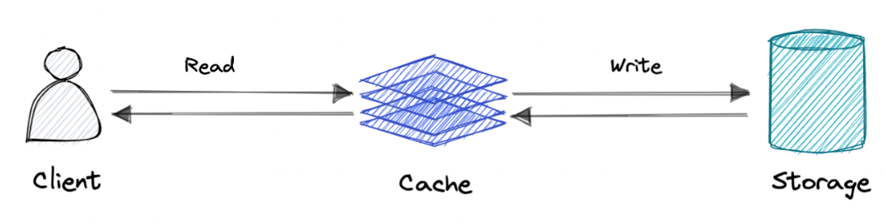
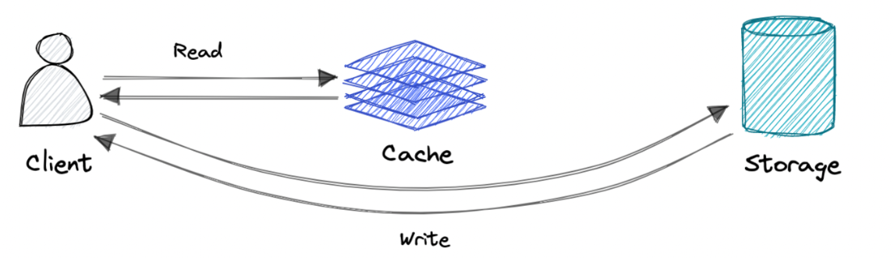
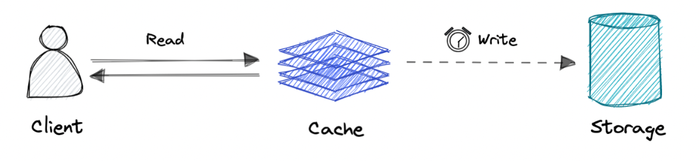
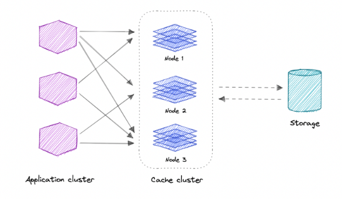

# ⚡ Caching — System Design Reference

A **cache** is a fast storage layer that stores frequently accessed data to reduce latency and load on slower backend systems.

It trades **capacity for speed**.

Caches are typically:

- In-memory
- Temporary (non-durable)
- Optimized for fast reads

---

## 📑 Table of Contents

- [Why Caching?](#-why-caching)
- [Cache Hit vs Cache Miss](#-cache-hit-vs-cache-miss)
- [Caching Strategies](#-caching-strategies)
- [Write Policies](#-write-policies)
- [Eviction Policies](#-eviction-policies)
- [Distributed Cache](#-distributed-cache)
- [Use Cases](#-use-cases)
- [When NOT to Use Caching](#-when-not-to-use-caching)
- [Advantages](#-advantages)
- [Common Technologies](#-common-technologies)
- [System Design Notes](#-system-design-notes)

---

## 🔍 Why Caching?

Caches improve performance by:

- Reducing database load
- Lowering latency
- Increasing throughput
- Handling traffic spikes

Caching relies on the **locality principle**:

> Recently requested data is likely to be requested again.

---

## 🎯 Cache Hit vs Cache Miss

### ✅ Cache Hit
Requested data is found in cache.

- Fast response
- No backend call required

---

### ❌ Cache Miss
Data not found in cache.

- Fetch from backend (DB/API)
- Store in cache
- Return response

---

## 🧠 Caching Strategies

### 1️⃣ Cache-Aside (Lazy Loading)

- App checks cache first
- On miss → fetch from DB → update cache

Most common pattern.

---

### 2️⃣ Read-Through

- Cache handles data retrieval
- Application interacts only with cache

Simplifies app logic.

---

### 3️⃣ Write-Through

Data written to cache and DB simultaneously.

**Pros**
- Strong consistency

**Cons**
- Higher write latency

---

### 4️⃣ Write-Around

Write goes directly to DB, bypassing cache.

**Pros**
- Avoids unnecessary cache pollution

**Cons**
- Higher read latency after write

---

### 5️⃣ Write-Back (Write-Behind)

Write goes to cache first.  
Cache asynchronously updates DB.

**Pros**
- Low write latency
- High throughput

**Cons**
- Risk of data loss if cache crashes

---

## 🗑 Eviction Policies

When cache is full, items must be removed.

Common strategies:

- **LRU** (Least Recently Used)
- **LFU** (Least Frequently Used)
- **FIFO**
- **Random Replacement**

In real systems, **LRU and LFU are most common**.

---

## 🌍 Distributed Cache

A distributed cache:

- Spreads data across multiple machines
- Increases capacity
- Improves availability
- Supports horizontal scaling

Used in large-scale systems where a single node cache is insufficient.

---

## 📦 Use Cases

Caching is commonly used for:

- Database query results
- Session storage
- API responses
- CDN (static content)
- DNS resolution
- Computation-heavy results

---

## 🚫 When NOT to Use Caching

Avoid caching when:

- Data changes extremely frequently
- Access patterns are highly random
- Cache access is as slow as backend
- Strong consistency is mandatory

Cache should **not** be treated as permanent storage.

---

## ✅ Advantages

- Improves performance
- Reduces latency
- Reduces database load
- Handles traffic spikes
- Increases read throughput

---

## 🛠 Common Technologies

- Redis
- Memcached
- Amazon ElastiCache
- Aerospike

---

## 🧠 System Design Notes

Interviewers may ask about:

- Cache invalidation (hard problem!)
- TTL trade-offs
- Cache consistency
- Thundering herd problem
- Cache stampede protection
- Distributed cache sharding
- Replication & failover

Caching is tightly connected to:

- Scalability
- Load balancing
- Database scaling
- CDN architecture

---