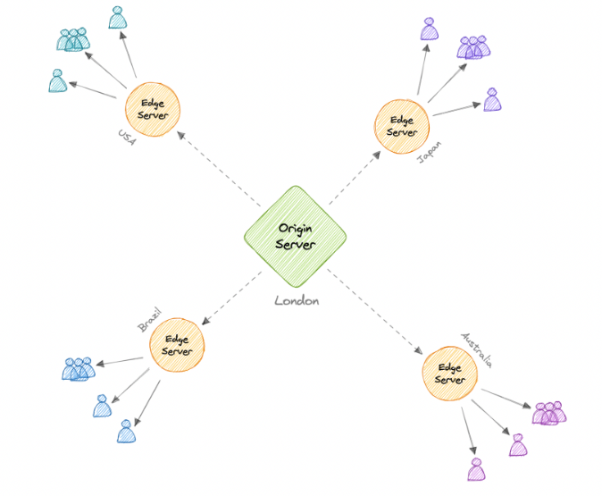

# 🌍 Content Delivery Network (CDN) — System Design Reference

A **Content Delivery Network (CDN)** is a geographically distributed network of servers that delivers content from locations closer to users to reduce latency and improve performance.

CDNs are mainly used for:

- Static content (HTML, CSS, JS)
- Images
- Videos
- Downloads
- APIs (in some cases)

---

## 📑 Table of Contents

- [Why Use a CDN?](#-why-use-a-cdn)
- [How a CDN Works](#-how-a-cdn-works)
- [Push vs Pull CDN](#-push-vs-pull-cdn)
- [Advantages](#-advantages)
- [Disadvantages](#-disadvantages)
- [Common Providers](#-common-providers)
- [System Design Notes](#-system-design-notes)

---

## 🚀 Why Use a CDN?

CDNs improve:

- Performance (lower latency)
- Scalability
- Availability
- Security
- Reduced origin server load

Instead of all users hitting the origin server, traffic is served from nearby edge servers.

---

## 🔄 How a CDN Works

Key components:

- **Origin Server** → Stores original content
- **Edge Servers** → Distributed globally, cache content

### Request Flow

1. User requests content
2. DNS routes user to nearest CDN edge
3. Edge checks cache:
   - If found → serve immediately (cache hit)
   - If not → fetch from origin → cache → serve (cache miss)
4. Future requests served from edge

This reduces:

- Latency
- Bandwidth cost
- Load on origin

---

## 📦 Push vs Pull CDN

### 🔹 Push CDN

- Content is manually uploaded to CDN
- You control when content updates
- URLs are rewritten to point to CDN

**Best for:**
- Low traffic sites
- Rarely changing content

**Pros**
- Predictable caching
- Less unexpected origin traffic

**Cons**
- More operational work
- Higher storage usage

---

### 🔹 Pull CDN

- CDN fetches content automatically from origin
- Triggered when user requests uncached content
- Most common model

**Best for:**
- High traffic sites
- Frequently accessed content

**Pros**
- Easier maintenance
- Automatic caching
- Efficient storage

**Cons**
- Initial request latency (cold cache)

---

## ✅ Advantages

- Reduced latency
- Improved user experience
- Lower origin server load
- DDoS mitigation
- Global scalability
- Bandwidth savings

---

## ⚠️ Disadvantages

- Additional cost
- Cache invalidation complexity
- Dependency on third-party provider
- Limited benefit if users are geographically concentrated

---

## 🛠 Common CDN Providers

- Amazon CloudFront
- Google Cloud CDN
- Cloudflare CDN
- Fastly

---

## 🧠 System Design Notes

CDNs are commonly used for:

- Static asset delivery
- Video streaming
- Software distribution
- API edge caching
- Global traffic optimization

Interview discussion points:

- Cache invalidation strategies
- TTL trade-offs
- CDN + Load Balancer architecture
- Geo-based routing
- CDN vs Reverse Proxy
- How CDN reduces latency

CDNs are often placed in front of:

DNS → CDN → Load Balancer → App Servers → Database

---

