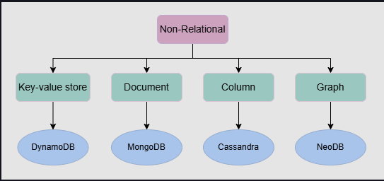
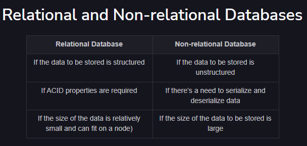
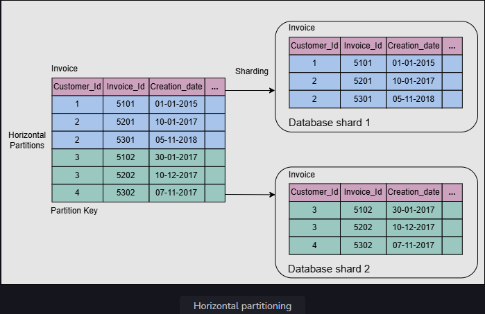
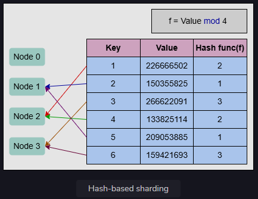
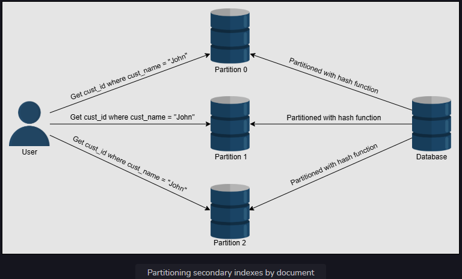
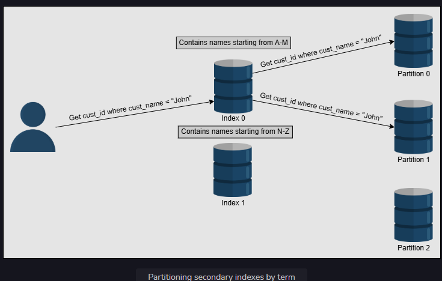

# Databases

A database is an organized collection of data that can be managed and accessed easily. Databases are created to make it easier to store, retrieve, modify, and delete data in connection with different data-processing procedures.

Databases are divided into two types: relational and non-relational

# Realtional databases

Relational databases adhere to particular schemas before storing the data. The data stored in relational databases has prior structure. Mostly, this model organizes data into one or more relations (also called tables), with a unique key for each tuple (instance)

Relational databases provide the atomicity, consistency, isolation, and durability (ACID) properties to maintain the integrity of the database.

* Atomicity: A transaction is considered an atomic unit. Therefore, either all the statements within a transaction will successfully execute, or none of them will execute. If a statement fails within a transaction, it should be aborted and rolled back.

* Consistency: At any given time, the database should be in a consistent state, and it should remain in a consistent state after every transaction. For example, if multiple users want to view a record from the database, it should return a similar result each time.

* Isolation: In the case of multiple transactions running concurrently, they shouldn’t be affected by each other. The final state of the database should be the same as the transactions were executed sequentially.

* Durability: The system should guarantee that completed transactions will survive permanently in the database even in system failure events.

### Why relational databases?

* Flexibility: In the context of SQL, data definition language (DDL) provides us the flexibility to modify the database, including tables, columns, renaming the tables, and other changes

* Reduced redundancy

* Concurrency

* Backup and disaster recovery

# non-relational (NoSQL) databases

hese databases are used in applications that require a large volume of semi-structured and unstructured data, low latency, and flexible data models. This can be achieved by relaxing some of the data consistency restrictions of other databases.

## Types of NoSQL databases

### Key-value database 

Key-value databases use key-value methods like hash tables to store data in key-value pairs. These databases allow easy partitioning and horizontal scaling of the data. 

**Example**: Amazon DynamoDB, Redis, and Memcached DB.

**Use case**: Key-value databases are efficient for session-oriented applications. Session oriented-applications, such as web applications, store users’ data in the main memory or in a database during a session. This data may include user profile information, recommendations, targeted promotions, discounts, and more. A unique ID (a key) is assigned to each user’s session for easy access and storage. Therefore, a better choice to store such data is the key-value database.

### Document database

A document database is designed to store and retrieve documents in formats like XML, JSON, BSON, and so on. These documents are composed of a hierarchical tree data structure that can include maps, collections, and scalar 

**Example**: MongoDB and Google Cloud Firestore

**Use case**: Document databases are suitable for unstructured catalog data, like JSON files or other complex structured hierarchical data. For example, in e-commerce applications, a product has thousands of attributes, which is unfeasible to store in a relational database due to its impact on the reading performance. Here comes the role of a document database, which can efficiently store each attribute in a single file for easy management and faster reading speed.

### Graph database

Graph databases use the graph data structure to store data, where nodes represent entities, and edges show relationships between entities. The organization of nodes based on relationships leads to interesting patterns between the nodes. This database allows us to store the data once and then interpret it differently based on relationships.

**Example**: Neo4J, OrientDB, and InfiniteGraph

**Use case**: Graph databases can be used in social applications and provide interesting facts and figures among different kinds of users and their activities. The focus of graph databases is to store data and pave the way to drive analyses and decisions based on relationships between entities. The nature of graph databases makes them suitable for various applications, such as data regulation and privacy, machine learning research, financial services-based applications, and many more.

### Columnar database 

Columnar database store data in columns instead of rows. They enable access to all entries in the database column quickly and efficiently.

**Example**: Cassandra, HBase, Hypertable, and Amazon SimpleDB

**Use case**: Columnar databases are efficient for a large number of aggregation and data analytics queries. It drastically reduces the disk I/O requirements and the amount of data required to load from the disk. For example, in applications related to financial institutions, there’s a need to sum the financial transaction over a period of time. Columnar databases make this operation quicker by just reading the column for the amount of money, ignoring other attributes of customers.

# Choose the right database

Various factors affect the choice of database to be used in an application. A comparison between the relational and non-relational databases is shown in the following table to help us choose:

# Replication

Replication refers to keeping multiple copies of the data at various nodes (preferably geographically distributed) to achieve availability, scalability, and performance

### Synchronous versus asynchronous replication

In synchronous replication, the primary node waits for acknowledgments from secondary nodes about updating the data. After receiving acknowledgment from all secondary nodes, the primary node reports success to the client. Whereas in asynchronous replication, the primary node doesn’t wait for the acknowledgment from the secondary nodes and reports success to the client after updating itself.

## Data replication models

1. Single leader or primary-secondary replication
2. Multi-leader replication
3. Peer-to-peer or leaderless replication

### Single leader/primary-secondary replication

In primary-secondary replication, data is replicated across multiple nodes. One node is designated as the primary. It’s responsible for processing any writes to data stored on the cluster. It also sends all the writes to the secondary nodes and keeps them in sync.

Primary-secondary replication is appropriate when our workload is read-heavy

There are many different replication methods in primary-secondary replication:

#### Statement-based replication

The primary node saves all statements that it executes, like insert, delete, update, and so on, and sends them to the secondary nodes to perform. This type of replication was used in MySQL before version 5.1.

This type of approach seems good, but it has its disadvantages. For example, any nondeterministic function (such as NOW()) might result in distinct writes on the follower and leader. Furthermore, if a write statement is dependent on a prior write, and both of them reach the follower in the wrong order, the outcome on the follower node will be uncertain.

#### Write-ahead log (WAL) shipping

The primary node saves the query before executing it in a log file known as a write-ahead log file. It then uses these logs to copy the data onto the secondary nodes. This is used in PostgreSQL and Oracle. The problem with WAL is that it only defines data at a very low level. It’s tightly coupled with the inner structure of the database engine, which makes upgrading software on the leader and followers complicated.

#### Logical (row-based) log replication

All secondary nodes replicate the actual data changes. For example, if a row is inserted or deleted in a table, the secondary nodes will replicate that change in that specific table. The binary log records change to database tables on the primary node at the record level. To create a replica of the primary node, the secondary node reads this data and changes its records accordingly. Row-based replication doesn’t have the same difficulties as WAL because it doesn’t require information about data layout inside the database engine.

### Multi-leader replication

Multi-leader replication is an alternative to single leader replication. There are multiple primary nodes that process the writes and send them to all other primary and secondary nodes to replicate. This type of replication is used in databases along with external tools like the Tungsten Replicator for MySQL.

This kind of replication is quite useful in applications in which we can continue work even if we’re offline—for example, a calendar application in which we can set our meetings even if we don’t have access to the internet. Once we’re online, it replicates its changes from our local database (our mobile phone or laptop acts as a primary node) to other nodes.

Since all the primary nodes concurrently deal with the write requests, they may modify the same data, which can create a conflict between them. 

#### Handle conflicts

1. **Conflict avoidance** -  A simple strategy to deal with conflicts is to prevent them from happening in the first place. Conflicts can be avoided if the application can verify that all writes for a given record go via the same leader. However, the conflict may still occur if a user moves to a different location and is now near a different data center. If that happens, we need to reroute the traffic. n such scenarios, the conflict avoidance approach fails and results in concurrent writes.

2. **Last-write-wins** - Using their local clock, all nodes assign a timestamp to each update. When a conflict occurs, the update with the latest timestamp is selected. This approach can also create difficulty because the clock synchronization across nodes is challenging in distributed systems. There’s clock skew that can result in data loss.

3. **Custom logic** - When the system detects a conflict, it calls our custom conflict handler.

#### Multi-leader replication topologies

There are many topologies through which multi-leader replication is implemented, such as circular topology, star topology, and all-to-all topology. The most common is the all-to-all topology. In star and circular topology, there’s again a similar drawback that if one of the nodes fails, it can affect the whole system. That’s why all-to-all is the most used topology.

### Peer-to-peer/leaderless replication

The peer-to-peer replication model resolves these problems by not having a single primary node. All the nodes have equal weightage and can accept reads and writes requests. Amazon popularized such a scheme in their DynamoDB data store.

A helpful approach used for solving write-write inconsistency is called quorums.

### Quorums

In short qourum means majority. odd number of nodes is recommended.

If we have n nodes, then every write must be updated in at least w nodes to be considered a success, and we must read from r nodes. We’ll get an updated value from reading as long as 
w + r > n n because at least one of the nodes must have an updated write from which we can read. Quorum reads and writes adhere to these r and w values. these n, w, and r are configurable in Dynamo-style databases.

**Example**:

Replication factor = 3

if we wish write operation to be fast
write qourum = 1
read qourom = 3

if we wish read to be fast
write qourum = 3
read qourum = 1

# Sharding

To divide load among multiple nodes, we need to partition the data by a phenomenon known as partitioning or sharding. In this approach, we split a large dataset into smaller chunks of data stored at different nodes on our network.

## Vertical sharding

We can put different tables in various database instances, which might be running on a different physical server. We might break a table into multiple tables so that some columns are in one table while the rest are in the other. We should be careful if there are joins between multiple tables. We may like to keep such tables together on one shard.

Often, vertical sharding is used to increase the speed of data retrieval from a table consisting of columns with very wide text or a binary large object (blob). In this case, the column with large text or a blob is split into a different table.

Vertical sharding has its intricacies and is more amenable to manual partitioning, where stakeholders carefully decide how to partition data. In comparison, horizontal sharding is suitable to automate even under dynamic conditions.

## Horizontal sharding

Horizontal sharding or partitioning is used to divide a table into multiple tables by splitting data row-wise . Each partition of the original table distributed over database servers is called a shard. Usually, there are two strategies available:

1. Key-range based sharding
2. Hash based sharding

### Key-range based sharding

In the key-range based sharding, each partition is assigned a continuous range of keys.

Sometimes, a database consists of multiple tables bound by foreign key relationships. In such a case, the horizontal partition is performed using the same partition key on all tables in a relation. Tables (or subtables) that belong to the same partition key are distributed to one database shard

**Advantages**

1. Using this method, the range-query-based scheme is easy to implement.
2. Range queries can be performed using the partitioning keys, and those can be kept in partitions in sorted order.

**Disadvantages**

1. Range queries can’t be performed using keys other than the partitioning key.
2. If keys aren’t selected properly, some nodes may have to store more data due to an uneven distribution of the traffic.

### Hash-based sharding

Hash-based sharding uses a hash-like function on an attribute, and it produces different values based on which attribute the partitioning is performed. The main concept is to use a hash function on the key to get a hash value and then mod by the number of partitions. Once we’ve found an appropriate hash function for keys, we may give each partition a range of hashes (rather than a range of keys). Any key whose hash occurs inside that range will be kept in that partition.

We can’t perform range queries with this technique. Keys will be spread over all partitions.

### Consistent hashing

Consistent hashing assigns each server or item in a distributed hash table a place on an abstract circle, called a ring, irrespective of the number of servers in the table. This permits servers and objects to scale without compromising the system’s overall performance.

**Advantages of consistent hashing**

- It’s easy to scale horizontally.
- It increases the throughput and improves the latency of the application.

**Disadvantages of consistent hashing**

* Randomly assigning nodes in the ring may cause non-uniform distribution.

## Rebalance the partitions

### Avoid hash mod n

Usually, we avoid the hash of a key for partitioning (we used such a scheme to explain the concept of hashing in simple terms earlier). The problem with the addition or removal of nodes in the case of **hasmodn** is that every node’s partition number changes and a lot of data moves

### Fixed number of partitions

In this approach, the number of partitions to be created is fixed at the time when we set our database up. We create a higher number of partitions than the nodes and assign these partitions to nodes. So, when a new node is added to the system, it can take a few partitions from the existing nodes until the partitions are equally divided.

### Dynamic partitioning

In this approach, when the size of a partition reaches the threshold, it’s split equally into two partitions. One of the two split partitions is assigned to one node and the other one to another node. In this way, the load is divided equally. The number of partitions adapts to the overall data amount, which is an advantage of dynamic partitioning.

However, there’s a downside to this approach. It’s difficult to apply dynamic rebalancing while serving the reads and writes. This approach is used in HBase and MongoDB.

### Partition proportionally to nodes

In this approach, the number of partitions is proportionate to the number of nodes, which means every node has fixed partitions. In earlier approaches, the number of partitions was dependent on the size of the dataset. That isn’t the case here. While the number of nodes remains constant, the size of each partition rises according to the dataset size. However, as the number of nodes increases, the partitions shrink. When a new node enters the network, it splits a certain number of current partitions at random, then takes one half of the split and leaves the other half alone. This can result in an unfair split. This approach is used by Cassandra and Ketama.

## ZooKeeper

To track changes in the cluster, many distributed data systems need a separate management server like ZooKeeper. Zookeeper keeps track of all the mappings in the network, and each node connects to ZooKeeper for the information. Whenever there’s a change in the partitioning, or a node is added or removed, ZooKeeper gets updated and notifies the routing tier about the change. HBase, Kafka and SolrCloud use ZooKeeper.

## Partitioning and secondary indexes

**Partitioning and secondary indexes**

This type of querying on secondary indexes can be expensive. As a result of being restricted by the latency of a poor-performing partition, read query latencies may increase.

**Partition secondary indexes by the term**

Instead of creating a secondary index for each partition (a local index), we can make a global index for secondary terms that encompasses data from all partitions.

Partitioning secondary indexes by the term is more read-efficient than partitioning secondary indexes by the document. This is because it only accesses the partition that contains the term. However, a single write in this approach affects multiple partitions, making the method write-intensive and complex.

