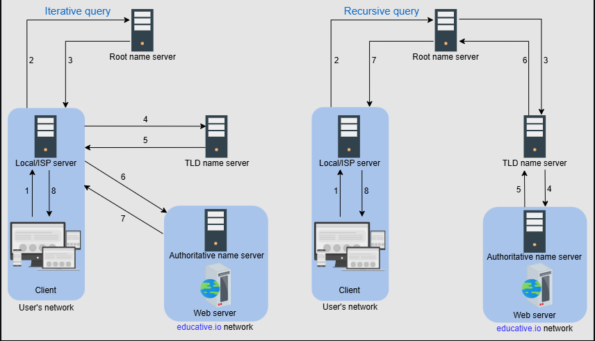

# What is DNS?
The domain name system (DNS) is the Internet’s naming service that maps human-friendly domain names to machine-readable IP addresses. The service of DNS is transparent to users. When a user enters a domain name in the browser, the browser has to translate the domain name to IP address by asking the DNS infrastructure. Once the desired IP address is obtained, the user’s request is forwarded to the destination web server.

The entire operation is performed very quickly. Therefore, the end user experiences minimum delay

# DNS hierarchy

There are mainly four types of servers in the DNS hierarchy:

1. DNS resolver: Resolvers initiate the querying sequence and forward requests to the other DNS name servers. Typically, DNS resolvers lie within the premise of the user’s network. However, DNS resolvers can also cater to users’ DNS queries through caching techniques, as we will see shortly. These servers can also be called local or default servers.

2. Root-level name servers: These servers receive requests from local servers. Root name servers maintain name servers based on top-level domain names, such as .com, .edu, .us, and so on. For instance, when a user requests the IP address of google.com, root-level name servers will return a list of top-level domain (TLD) servers that hold the IP addresses of the .com domain.

3. Top-level domain (TLD) name servers: These servers hold the IP addresses of authoritative name servers. The querying party will get a list of IP addresses that belong to the authoritative servers of the organization.

4. Authoritative name servers: These are the organization’s DNS name servers that provide the IP addresses of the web or application servers.

### Iterative versus recursive query resolution
There are two ways to perform a DNS query:

Iterative: The local server requests the root, TLD, and the authoritative servers for the IP address.
Recursive: The end user requests the local server. The local server further requests the root DNS name servers. The root name servers forward the requests to other name servers.

Typically, an iterative query is preferred to reduce query load on DNS infrastructure.

## Caching
Caching refers to the temporary storage of frequently requested resource records. A record is a data unit within the DNS database that shows a name-to-value binding. Caching reduces response time to the user and decreases network traffic. When we use caching at different hierarchies, it can reduce a lot of querying burden on the DNS infrastructure. Caching can be implemented in the browser, operating systems, local name server within the user’s network, or the ISP’s DNS resolvers.

Note: Even if there is no cache available to resolve a user’s query and it’s imperative to visit the DNS infrastructure, caching can still be beneficial. The local server or ISP DNS resolver can cache the IP addresses of TLD servers or authoritative servers and avoid requesting the root-level server.

Consistency can suffer because of caching too. Since authoritative servers are located within the organization, it may be possible that certain resource records are updated on the authoritative servers in case of server failures at the organization. Therefore, cached records at the default/local and ISP servers may be outdated. To mitigate this issue, each cached record comes with an expiration time called time-to-live (TTL).

There are 13 logical root name servers (named letter A through M) with many instances spread throughout the globe. These servers are managed by 12 different organizations.

Protocol: Although many clients use DNS over unreliable user datagram protocol (UDP), UDP has its advantages. UDP is much faster and, therefore, improves DNS performance