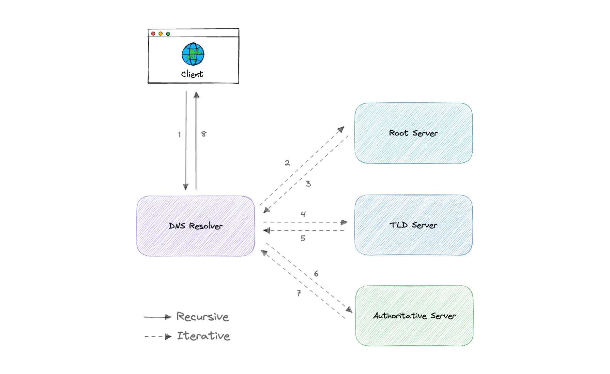

# 🌍 Domain Name System (DNS)

The **Domain Name System (DNS)** is a hierarchical and decentralized naming system that translates **human-readable domain names (example.com)** into **IP addresses (93.184.216.34)**.

DNS is a **critical internet infrastructure component** and often appears in **system design interviews**.

---

## 📑 Table of Contents

- [Overview](#-overview)
- [How DNS Works](#-how-dns-works)
- [Core DNS Server Types](#-core-dns-server-types)
- [DNS Query Types](#-dns-query-types)
- [DNS Caching & TTL](#-dns-caching--ttl)
- [Important DNS Records](#-important-dns-records)
- [Reverse DNS](#-reverse-dns)
- [Managed DNS Providers](#-managed-dns-providers)

---

## 🔍 Overview

DNS provides:

- Name → IP resolution  
- Scalability using hierarchy  
- Reliability using distribution and caching  

Without DNS, users would need to remember IP addresses instead of domain names.

---

## 🔄 How DNS Works

Typical lookup flow:

1. Browser → DNS Resolver  
2. Resolver → Root server  
3. Root → TLD server (.com, .org, etc.)  
4. TLD → Authoritative nameserver  
5. Authoritative → IP address  
6. Resolver → Browser

Then the browser connects directly to the IP.

---

## 🏛 Core DNS Server Types

### 1. DNS Resolver (Recursive Resolver)

- First stop for the client  
- Handles the full lookup process  
- Uses cache whenever possible  

Examples: ISP DNS, Google (8.8.8.8), Cloudflare (1.1.1.1)

---

### 2. Root Nameserver

- Top of the DNS hierarchy  
- Directs resolvers to TLD servers  
- 13 logical root server clusters worldwide  

---

### 3. TLD Nameserver

- Handles domain extensions  
- Examples: `.com`, `.org`, `.in`, `.net`  
- Points to authoritative nameservers  

---

### 4. Authoritative Nameserver

- Final source of truth  
- Stores actual DNS records  
- Returns IP or alias  

This is where **your domain’s DNS is configured.**

---

## ❓ DNS Query Types (High level)

### Recursive  
Client expects **final answer**.  
(Used by browsers)

### Iterative  
Server returns **best it knows** and referral.

### Non-recursive  
Answer already in cache.

👉 In real life system design: **clients use recursive, servers handle iterative internally.**

---

## ⚡ DNS Caching & TTL

DNS heavily relies on **caching** to:

- Reduce latency  
- Reduce root/TLD load  
- Improve availability  

Each record has a **TTL (Time To Live)**:

- Defines how long it can be cached  
- Low TTL → faster updates, more load  
- High TTL → better performance, slower changes  

This is a **common system design tradeoff.**

---

## 📘 Important DNS Records

| Record | Purpose |
|-------|-----------|
A     | IPv4 address  
AAAA  | IPv6 address  
CNAME | Alias to another domain  
MX    | Mail server  
NS    | Authoritative name servers  
TXT   | Verification, security (SPF, DKIM, etc.)  
SOA   | Zone admin & metadata  
PTR   | Reverse lookup  

For interviews, **A, AAAA, CNAME, MX, NS, TXT, PTR** are enough.

---

## 🔁 Reverse DNS

Maps **IP → domain name** using PTR records.

Commonly used for:

- Email server validation  
- Anti-spam checks  

Not mandatory for normal web browsing, but **important for trust systems.**

---

## ☁ Managed DNS Providers

Widely used managed DNS platforms:

- AWS Route 53  
- Cloudflare DNS  
- Google Cloud DNS  
- Azure DNS  
- NS1  

Managed DNS provides:

- Global routing  
- Health checks  
- Geo-based resolution  
- DDoS protection  

---

## 🧠 System Design Interview Notes

DNS is used for:

- Load balancing  
- Geo-routing  
- Failover  
- Service discovery  
- High availability  

Interviewers often test:

- Caching behavior  
- TTL tradeoffs  
- Failover handling  
- Global traffic routing  

---