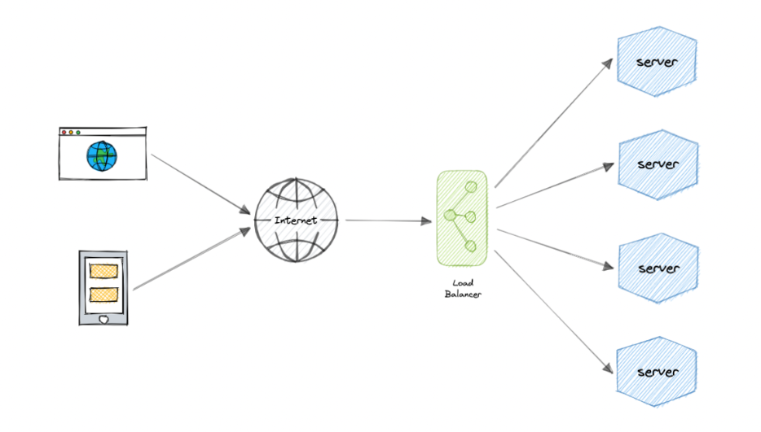
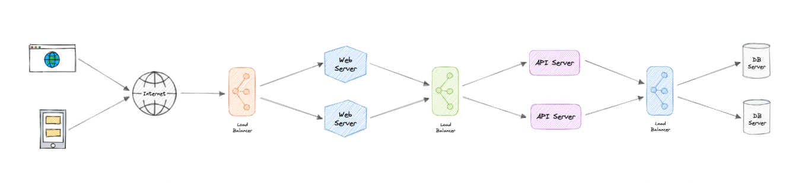

# ⚖️ Load Balancers — System Design Reference

Load balancing distributes incoming traffic across multiple servers to ensure:

- High availability  
- Scalability  
- Reliability  
- Fault tolerance  

Instead of one server handling all traffic, a load balancer spreads requests across multiple backend servers.

---

## 📑 Table of Contents

- [Why Load Balancing?](#-why-load-balancing)
- [How It Works](#-how-it-works)
- [Load Balancing Layers](#-load-balancing-layers)
- [Types of Load Balancers](#-types-of-load-balancers)
- [Routing Algorithms](#-routing-algorithms)
- [System Design Notes](#-system-design-notes)

---

## 🚀 Why Load Balancing?

Modern systems must handle:

- Millions of concurrent users  
- Traffic spikes  
- Hardware failures  

Without load balancing:

- One server becomes a bottleneck  
- Server failure brings the entire system down  

With a load balancer:

- Traffic is evenly distributed  
- Failed servers are removed automatically  
- New servers can be added dynamically  

---

## 🔄 How It Works

1. Client sends request  
2. Load balancer receives it  
3. Chooses a backend server  
4. Forwards request  
5. Returns response  

If a server fails → traffic is redirected to healthy servers.

---

## 🏗 Load Balancing Layers

Load balancers typically operate at:

### 🔹 Layer 4 (Transport Layer)

- Routes based on IP + Port  
- Does NOT inspect request content  
- Faster and lightweight  
- High performance  

Example: TCP/UDP load balancing  

---

### 🔹 Layer 7 (Application Layer)

- Inspects full request (URL, headers, cookies)  
- Supports content-based routing  
- Can route based on path (`/api`, `/images`)  
- Enables advanced features  

Example:
- `/api/*` → API servers  
- `/static/*` → CDN or static servers  

Layer 7 is more flexible but slightly heavier.

---

## 🧩 Types of Load Balancers

### 1️⃣ Software Load Balancer

- Runs on standard servers  
- Highly flexible  
- Cost-effective  
- Common in cloud environments  

Examples:
- Nginx  
- HAProxy  
- Cloud-managed services (AWS ALB, etc.)

---

### 2️⃣ Hardware Load Balancer

- Dedicated physical device  
- Extremely high throughput  
- Expensive  
- Limited flexibility  

Mostly used in large enterprise data centers.

---

### 3️⃣ DNS Load Balancing

- DNS returns multiple IP addresses  
- Client selects one  

⚠ Limitations:
- No real-time health checking  
- TTL caching can cause stale routing  
- Slower failover  

Used mainly for:
- Geo-routing  
- Basic distribution  

---

## 📊 Routing Algorithms

Common traffic distribution strategies:

### 🔁 Round Robin
Requests are distributed sequentially.

---

### ⚖️ Weighted Round Robin
Servers receive traffic based on assigned weights.

Useful when servers have different capacities.

---

### 🔌 Least Connections
Sends request to server with fewest active connections.

Good for uneven traffic loads.

---

### ⏱ Least Response Time
Chooses server with fastest response + fewest connections.

Optimizes latency.

---

### 📉 Least Bandwidth
Routes to server currently using least bandwidth.

---

### 🔑 Hash-Based Routing
Uses key (e.g., client IP, URL) to route traffic.

Useful for:
- Session persistence  
- Caching consistency  

---

## 🧠 System Design Notes

Load balancers help with:

- Horizontal scaling  
- High availability  
- Zero downtime deployments  
- Blue/Green deployments  
- Canary releases  

Common interview topics:

- Sticky sessions (session persistence)  
- Health checks  
- Failover strategy  
- Auto-scaling integration  
- Global vs regional load balancing  

---

## 🌍 Multi-Layer Load Balancing

Large systems often use load balancing at multiple levels:

Example:

- DNS (geo routing)
- Global load balancer
- Regional load balancer
- Service-level load balancer

---