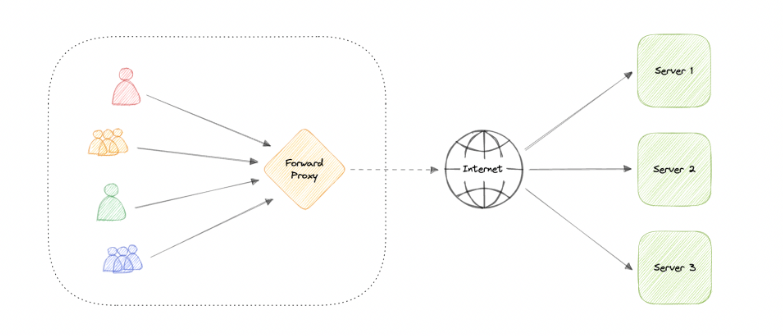
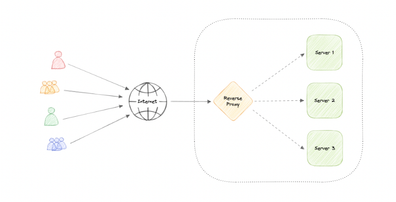

# 🔄 Proxy — System Design Reference

A **proxy server** is an intermediary that sits between a client and a server.

It receives requests, forwards them to the destination server, and returns the response back to the client.

Proxies are commonly used for:

- Security
- Logging
- Caching
- Traffic control
- Header manipulation
- Encryption / Decryption

---

## 📑 Table of Contents

- [What is a Proxy?](#-what-is-a-proxy)
- [Types of Proxies](#-types-of-proxies)
  - [Forward Proxy](#-forward-proxy)
  - [Reverse Proxy](#-reverse-proxy)
- [Reverse Proxy vs Load Balancer](#-reverse-proxy-vs-load-balancer)
- [Advantages](#-advantages)
- [Common Technologies](#-common-technologies)
- [System Design Notes](#-system-design-notes)

---

## 🔍 What is a Proxy?

A proxy acts as a **middleman** between:

- Client → Server  
or  
- Internet → Backend servers  

It can:

- Filter requests
- Log traffic
- Modify headers
- Compress content
- Terminate SSL
- Cache responses

---

## 🧭 Types of Proxies

### 🔹 Forward Proxy

A **forward proxy** sits in front of the client.

Client → Forward Proxy → Internet

The destination server never sees the real client directly.

#### Use Cases

- Block access to certain websites
- Access geo-restricted content
- Hide client identity (basic anonymity)
- Enforce enterprise browsing policies

#### Key Idea

Forward proxy protects and controls **clients**.

---

### 🔹 Reverse Proxy

A **reverse proxy** sits in front of one or more backend servers.

Client → Reverse Proxy → Backend Server(s)

The client never directly communicates with the backend.

#### Capabilities

- Load balancing
- SSL termination
- Caching
- Security filtering
- Rate limiting
- Request routing
- Hiding internal architecture

#### Key Idea

Reverse proxy protects and manages **servers**.

---

## ⚖️ Reverse Proxy vs Load Balancer

They overlap, but they are not identical.

| Reverse Proxy | Load Balancer |
|---------------|---------------|
Can work with single or multiple servers | Requires multiple servers  
Can do caching, SSL termination, routing | Primarily distributes traffic  
Understands application-level data (Layer 7) | Often Layer 4 or Layer 7  

👉 A reverse proxy **can act as a load balancer**.  
👉 A load balancer does not necessarily provide full reverse proxy features.

---

## ✅ Advantages of Reverse Proxy

- Improved security (hide backend servers)
- SSL termination
- Caching (reduce backend load)
- Centralized authentication
- Load balancing
- Scalability

---

## ⚠️ Trade-offs

- Adds infrastructure complexity
- Can become a single point of failure
- Requires proper monitoring and failover setup

In production systems, reverse proxies are often deployed in clusters for redundancy.

---

## 🛠 Common Proxy Technologies

- Nginx
- HAProxy
- Traefik
- Envoy

Most modern cloud load balancers internally behave like reverse proxies.

---

## 🧠 System Design Notes

Reverse proxies are used for:

- API gateways
- Microservices routing
- Zero-downtime deployments
- Canary releases
- Rate limiting
- Web application firewall (WAF)

Interview topics may include:

- Where to terminate SSL?
- How to avoid single point of failure?
- Reverse proxy vs CDN?
- Layer 4 vs Layer 7 routing?

---